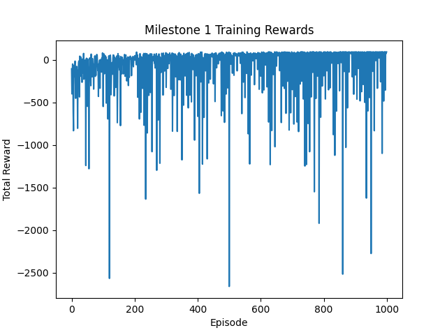
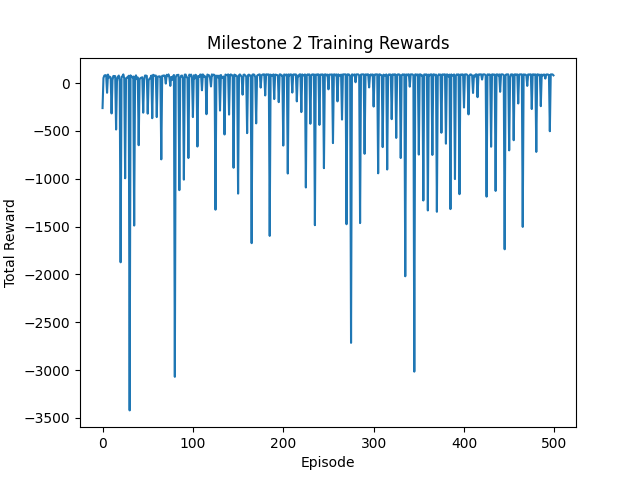
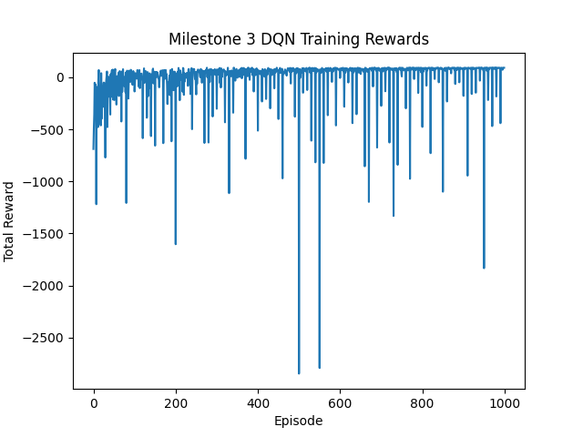

# Intelligent Maze Solver: Q-Learning and Deep Q-Network Agents Using Reinforcement Learning


This project demonstrates the design and implementation of **intelligent agents** capable of solving NxM maze environments using **Reinforcement Learning (RL)** techniques. The repository explores multiple approaches:

1. **Q-Learning with self-play exploration**  
2. **Q-Learning enhanced with historical gameplay data**  
3. **Deep Q-Network (DQN) using PyTorch**  

The goal is to compare classic tabular Q-Learning with modern deep RL methods, illustrating policy optimization, exploration strategies, and scalability to complex environments.  

---

## **Table of Contents**
- [Project Overview](#project-overview)  
- [Maze Environment](#maze-environment)  
- [Implemented Agents](#implemented-agents)  
  - [Q-Learning Agent](#q-learning-agent)  
  - [Q-Learning with Historical Data](#q-learning-with-historical-data)  
  - [Deep Q-Network (DQN) Agent](#deep-q-network-dqn-agent)  
- [Evaluation Summary](#evaluation-summary)  
- [Analysis & Insights](#analysis--insights)  
- [Usage](#usage)   

---

## **Project Overview**
This project focuses on training autonomous agents to navigate a maze environment:

- **Start position:** `(0,0)`  
- **Goal position:** `(N-1,M-1)`  
- **Obstacles:** Randomly placed walls (~10% of cells)  

The agents can perform four actions: **Up, Down, Left, Right**, with rewards structured as:

- `+100` for reaching the goal  
- `-1` for each move  
- `-10` for hitting a wall or invalid action  

The project demonstrates the evolution of RL strategies from **tabular methods** to **deep function approximation**, highlighting convergence, policy optimization, and exploration techniques.  

---

## **Maze Environment**
Implemented in Python, the `MazeEnvironment` class provides:

- `reset()` → resets the agent to the start state  
- `step(state, action)` → returns `(next_state, reward, done)`  
- Automatic handling of walls, goal, and invalid moves  

The environment serves as a benchmark for testing different RL agents.

---

## **Implemented Agents**

### **Q-Learning Agent**
- Classic **tabular Q-Learning** trained via self-play.  
- Features:
  - Learning rate α = 0.1, discount factor γ = 0.9  
  - Epsilon-greedy exploration (ϵ decays from 0.9 → 0.1)  
  - 3-step random exploration every 5 episodes to encourage diverse state coverage  

**Training Rewards:**


**Performance:**
- Success Rate: 1.0  
- Average Steps: 10.0  

**Code:** [`src/maze1.py`](src/maze1.py)

---

### **Q-Learning with Historical Data**
- Enhances Q-Learning by pre-training on “good” gameplay trajectories.  
- Features:
  - Prioritize learning from effective states with α = 0.15  
  - Reduced initial exploration ϵ = 0.5  
  - Continues training for additional episodes to refine the policy  

**Training Rewards (Comparison with Q-Learning Agent):**


**Performance:**
- Success Rate: 1.0  
- Average Steps: 10.0  

**Analysis:**  
Historical trajectories accelerate convergence and reduce exploration variance while maintaining an optimal policy.  

**Code:** [`src/maze2.py`](src/maze2.py)

---

### **Deep Q-Network (DQN) Agent**
- Replaces the Q-table with a neural network for **function approximation**.  
- Network architecture:
  - Input: One-hot vector of state (size N×M)  
  - Two hidden layers (64 neurons each) + ReLU  
  - Dropout (p=0.3) after first layer  
  - Output layer: 4 actions (Up, Down, Left, Right)  

- Features:
  - Experience replay buffer (size 1000)  
  - Batch size = 32, Learning rate = 0.001, γ = 0.9  
  - Huber loss for stable learning  
  - Target network frozen every 10 episodes  
  - Epsilon-greedy exploration (0.9 → 0.1)  

**Training Rewards:**


**Performance:**
- Success Rate: 1.0  
- Average Steps: 10.0  

**Analysis:**  
DQN learns an optimal policy even with fluctuating rewards. Unlike tabular methods, it **generalizes across states**, making it scalable for larger or more complex mazes.  

**Code:** [`src/maze3.py`](src/maze3.py)

---

## **Evaluation Summary**
| Agent                         | Success Rate | Average Steps |
|--------------------------------|--------------|---------------|
| Q-Learning Self-Play           | 1.0          | 10.0          |
| Q-Learning + Historical Data   | 1.0          | 10.0          |
| Deep Q-Network (DQN)           | 1.0          | 10.0          |

---

## **Analysis & Insights**
- Random exploration steps enhance coverage and early learning.  
- Historical gameplay trajectories reduce convergence time for tabular Q-Learning.  
- Dropout and target network freezing stabilize DQN training.  
- All agents successfully solve a 6×6 maze optimally, with **minimal steps**.  
- DQN is highly scalable and generalizes to larger mazes where Q-Tables are infeasible.  

---

## **Usage**
Run any agent by executing its script **from the `src/` folder**:

```bash
cd src
python maze1.py  # Q-Learning Self-Play
python maze2.py  # Q-Learning + Historical Data
python maze3.py  # Deep Q-Network
